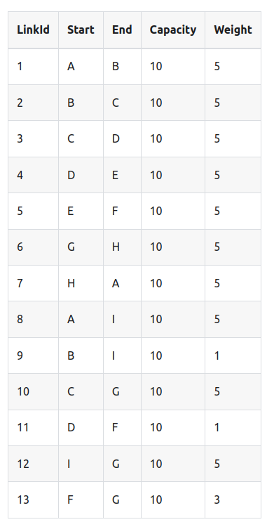
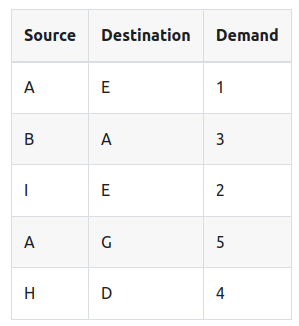

# Network Modelling Tool
This is a network modelling tool.

The goal of this tool is to load a network that is described in a CSV file and some traffic data, then we'll model the traffic flowing over the network to determine the utilization of each link within the network.

This shows the network designer how close to capacity their network is.

Imagine we have this network:


It might be represented like this:



Our traffic can look like:



This tool will use the source from the traffic to calculate the shortest path to all the nodes in the network using dijkstra's algorithm. Then it will provide tha path that the traffic will use. It also calculates the utilization of each link within the network.

# Example

The shortest path for traffic to flow from `H` to `D` is ['D', 'F', 'G', 'H']

```
===================================================
Network Details For Traffic Path:  ['D', 'F', 'G', 'H']
source:  D
destination:  F
Capaicity:  10
Capacity Utilization:  40 %

source:  F
destination:  G
Capaicity:  10
Capacity Utilization:  40 %

source:  G
destination:  H
Capaicity:  10
Capacity Utilization:  40 %

===================================================
```

NOTE: For simplicity, we assume each link is bi-directional with symmetrical capacity.

# How to use this tool

1. Load your network in the network.csv
1. Load your traffic data in the traffic.csv
1. Run `pip install -r requirements.txt`
1. Run `python main.py`

You'll get an output like this:
```
$ python3 main.py 
Network Details For Traffic Path:  ['G', 'H', 'A']
source:  G
destination:  H
Capaicity:  10
Capacity Utilization:  50 %

source:  H
destination:  A
Capaicity:  10
Capacity Utilization:  50 %

===================================================
```